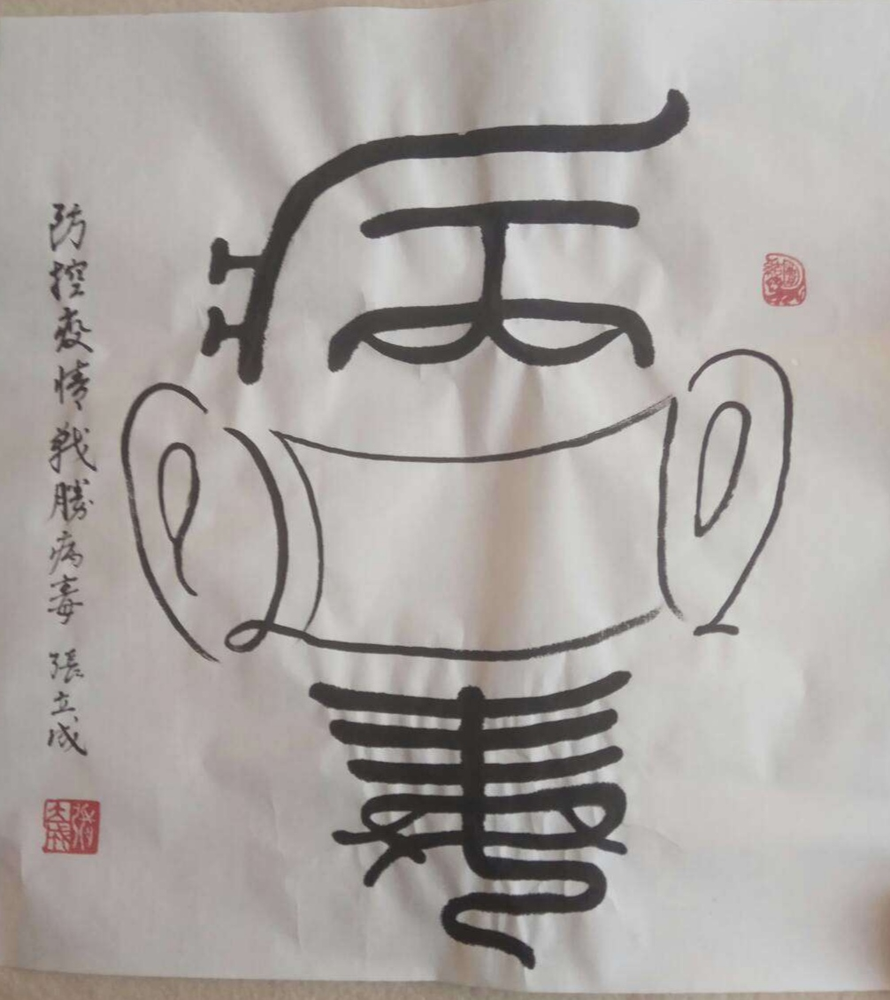

<head>

     <meta http-equiv="Content-Type" content="text/html; charset=utf-8" />

     <meta http-equiv="Content-Language" content="zh-CN" />

 </head>
# 欢迎来到个人书法网站
## Welcome to personal Chineses calligraphy website
 
 
## 我是一名中国书法爱好者，练习书法已几十年，精通草书，行书，楷书。常年发表书法作品。在此展示部分我的书法作品。 
### I am a Chineses calligraphy practicer.It's been several decades, I'm good at  grass script, running hand, regular script and  almost create calligraphy works every year.
### Here are my partial works.
 
 
 

##  3.作品简介:
### 3.Introduction of Works: 
 
 
## 防控疫情，战胜病毒
### Prevention and Control of pandemics, win the war of COVID-19
 
 
### 日期：20200130
####  Date：20200130

 <td width="50%">
            
    </td>

 
 
##  2.作品简介:
## 2.Introduction of Works: 
 
 
## 福
## blessing
 
 
### 日期：不详
### Date：unknown

 <td width="50%">
            
    </td>

 
 
##  1.作品简介:
## 1.Introduction of Works: 

## 中国梦
## Chinese Dream

### 日期：不详
### Date：unknown

 <td width="50%">
            
    </td>

### Jekyll Themes

Your Pages site will use the layout and styles from the Jekyll theme you have selected in your [repository settings](https://github.com/zyyyjack/zyyyjack.github.io/settings/pages). The name of this theme is saved in the Jekyll `_config.yml` configuration file.

