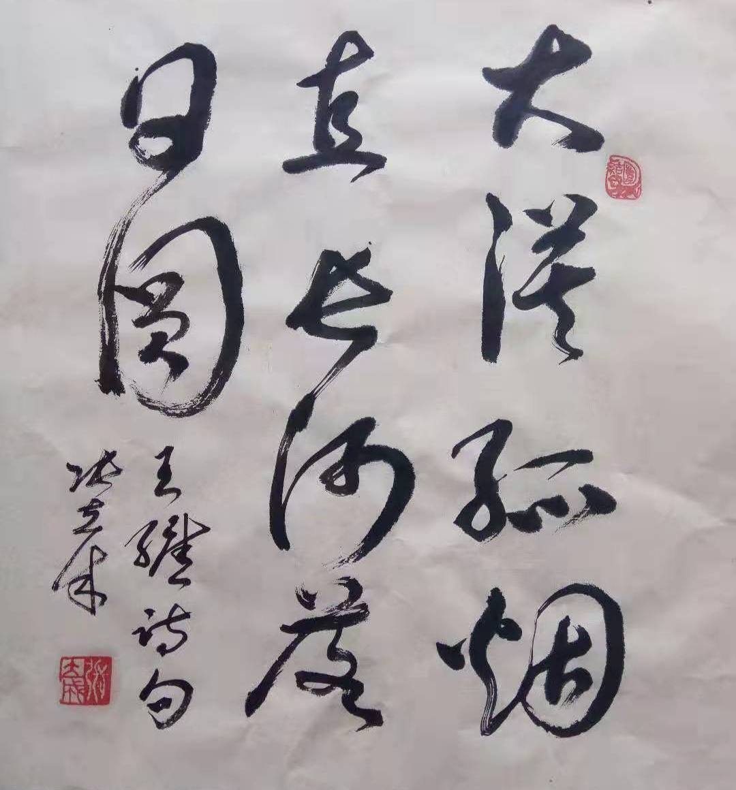
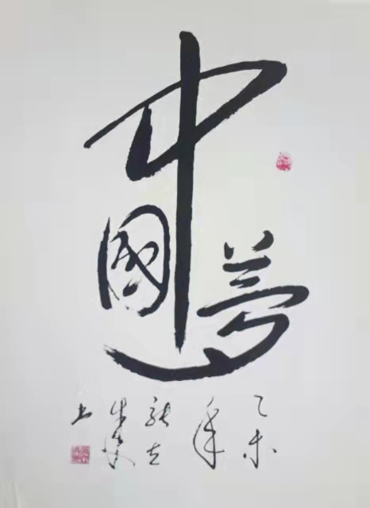

<head>

     <meta http-equiv="Content-Type" content="text/html; charset=utf-8" />
calligraphy
     <meta http-equiv="Content-Language" content="zh-CN" />

 </head>
# 欢迎来到个人书法网站
### Welcome to personal Chineses calligraphy website
 

## 我是一名中国书法爱好者，练习书法已几十年，酷爱草书，兼行，楷，隶。常年发表书法作品。我于1989年入中国书画函授大学，宁夏书画函授专修学院（原宁夏分校）书法大专班学习,1992年毕业,在此展示部分我的书法作品。
### I am a Chineses calligraphy practicer.It's been several decades, I'm good at  grass script, and sometimes practice running hand, regular script and  li calligraphy(an ancient style of calligraphy current in the Han Dynasty).I entered calligraphy training class of Chinese painting and calligraphy correspondence college of Ningxia province in 1989  and graduated from 1992.I usually create calligraphy works every year.  Here are my partial works.
 
 

## 7.
## 致富脱贫跟党走
## 扶贫济困奔康宁
## 
## 华夏儿女心相连
## 一路高歌猛进
## 插上腾飞的翅膀
## 实现祖国强胜的梦想
## 
<td width="50%">
            
    </td>

 
 
## 6.
## 天高云淡，
## 望断南飞雁。
## 不到长城非好汉，
## 屈指行程二万。
## 六盘山上高峰，
## 红旗漫卷西风。
## 今日长缨在手，
## 何时缚住苍龙？ 
<td width="50%">
            
    </td>

 
 
## 5.
## 大漠孤烟直,长河落日圆
<td width="50%">
            
    </td>

 
 
## 4.
## 千里黄云白日曛，北风吹雁雪纷纷。
## 莫愁前路无知己，天下谁人不识君。
<td width="50%">
            
    </td>

 
 
##  3.作品简介:
### 3.Introduction of Works:
## 防控疫情，战胜病毒
### Prevention and Control of pandemics, win the war of COVID-19
### 日期：20200130
####  Date：20200130
 <td width="50%">
            
    </td>

 
 
 
##  2.作品简介:
## 2.Introduction of Works: 
## 福
## blessing
### 日期：2011
### Date：2011
 <td width="50%">
            
    </td>

 
 
 
##  1.作品简介:
## 1.Introduction of Works: 
## 中国梦
## Chinese Dream
### 日期：2015
### Date：2015
 <td width="50%">
            
    </td>

### 谢谢观赏 Thank you for watching 未完待续  to be continue

